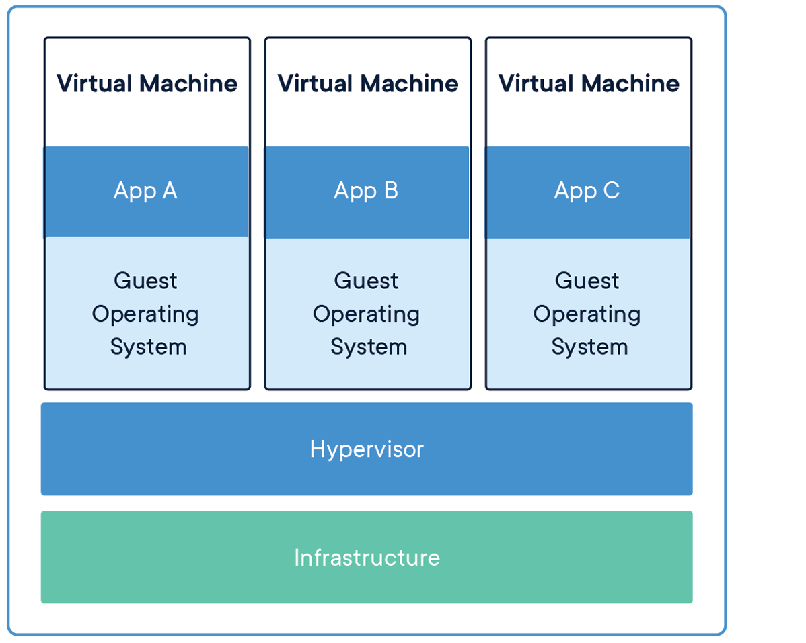
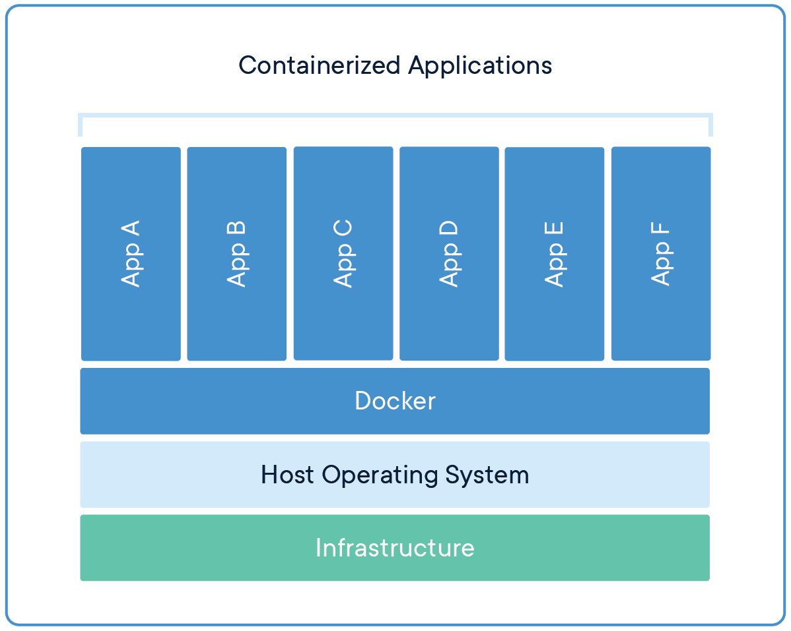

# Virtual Machine

- Dalam dunia Infrastructure, kita sudah terbiasa dengan yang namanya VM (Virtual Machine)
- Saat membuat sebuah VM, biasanya kita akan menginstall sistem operasi juga di VM nya 
- Masalah ketika kita menggunakan VM adalah proses yang lambat ketika pembuatan VM nya, dan butuh waktu untuk boot sistem operasi di dalam VM tersebut ketika kita menjalankan VM atau me-restart VM tersebut 

### Diagram Virtual Machine

# Container

- Berbeda dengan VM, Container sendiri berfokus pada sisi Aplikasi
- Container sendiri sebenarnya berjalan diatas aplikasi Container Manager yang berjalan di sistem operasi. 
- Yang membedakan dengan VM adalah, pada Container, kita bisa mem-package aplikasi dan dependency-nya tanpa harus menggabungkan sistem operasi 
- Container akan menggunakan sistem operasi host dimana Container Manager nya berjalan, oleh karena itu, Container akan lebih hemat resource dan lebih cepat jalan nya, karena tidak butuh sistem operasi sendiri 
- Ukuran Container biasanya hanya hitungan MB, berbeda dengan VM yang bisa sampai GB karena di dalamnya ada sistem operasinya 

### Diagram Container

