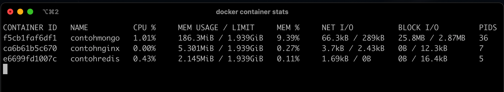

# Container Stats

- Saat menjalankan beberapa container, di sistem Host, penggunaan resource seperti CPU dan Memory hanya terlihat digunakan oleh Docker saja
- Kadang kita ingin melihat detail dari penggunaan resource untuk tiap container nya 
- Untungnya docker memiliki kemampuan untuk melihat penggunaan resource dari tiap container yang sedang berjalan 
- Kita bisa gunakan perintah : ```docker container stats```


