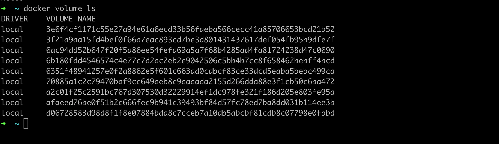
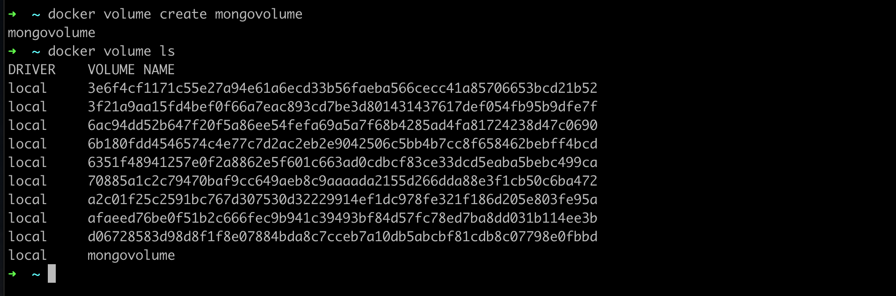
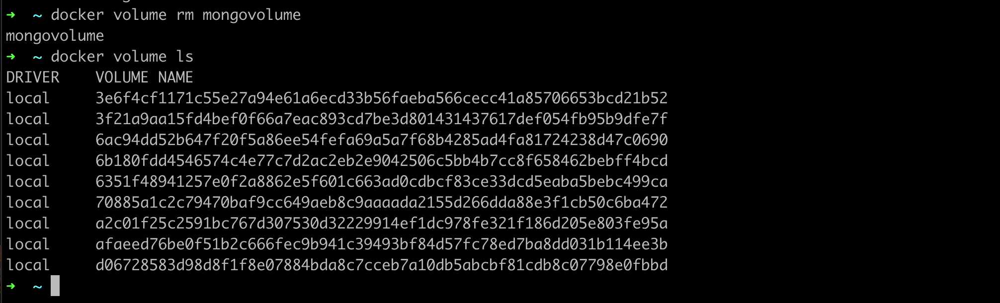

# Docker Volume

- Fitur Bind Mounts sudah ada sejak Docker versi awal, di versi terbaru direkomendasikan menggunakan Docker Volume
- Docker Volume mirip dengan Bind Mounts, bedanya adalah terdapat management Volume, dimana kita bisa membuat Volume, melihat daftar Volume, dan menghapus Volume 
- Volume sendiri bisa dianggap storage yang digunakan untuk menyimpan data, bedanya dengan Bind Mounts, pada bind mounts, data disimpan pada sistem host, sedangkan pada volume, data di manage oleh Docker 

### Melihat Docker Volume

- Saat kita membuat container, dimanakah data di dalam container itu disimpan, secara default semua data container disimpan di dalam volume
- Jika kita coba melihat docker volume, kita akan lihat bahwa ada banyak volume yang sudah terbuat, walaupun kita belum pernah membuatnya sama sekali 
- Kita bisa gunakan perintah berikut untuk melihat daftar volume : ```docker volume ls```



### Membuat Volume

- Untuk membuat volume, kita bisa gunakan perintah : ```docker volume create namavolume```



### Menghapus Volume

- Volume yang tidak digunakan oleh container bisa kita hapus, tapi jika volume digunakan oleh container, maka tidak bisa kita hapus sampai container nya di hapus
- Untuk menghapus volume, kita bisa gunakan perintah : ```docker volume rm namavolume```


