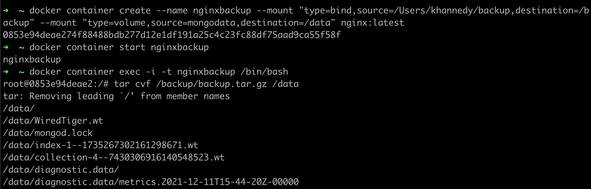
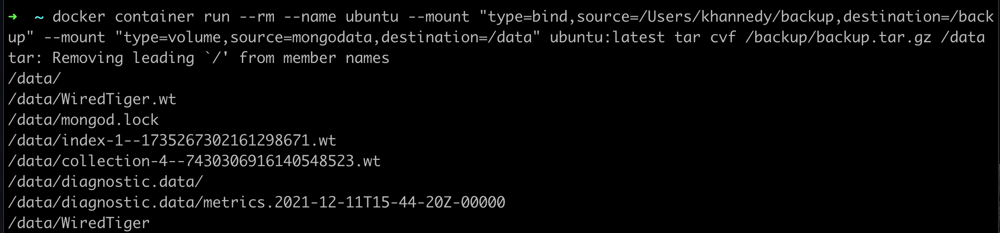

# Backup Volume

- Sayangnya, sampai saat ini, tidak ada cara otomatis melakukan backup volume yang sudah kita buat
- Namun kita bisa memanfaatkan container untuk melakukan backup data yang ada di dalam volume ke dalam archive seperti zip atau tar.gz 

### Tahapan Melakukan Backup

-  Matikan container yang menggunakan volume yang ingin kita backup
-  Buat container baru dengan dua mount, volume yang ingin kita backup, dan bind mount folder dari sistem host
-  Lakukan backup menggunakan container dengan cara meng-archive isi volume, dan simpan di bind mount folder
-  Isi file backup sekarang ada di folder sistem host
-  Delete container yang kita gunakan untuk melakukan backup

### Menjalankan Container Secara Langsung

- Melakukan backup secara manual agak sedikit ribet karena kita harus start container terlebih dahulu, setelah backup, hapus container nya lagi
- Kita bisa menggunakan perintah run untuk menjalankan perintah di container dan gunakan parameter --rm untuk melakukan otomatis remove container setelah perintahnya selesai berjalan 

