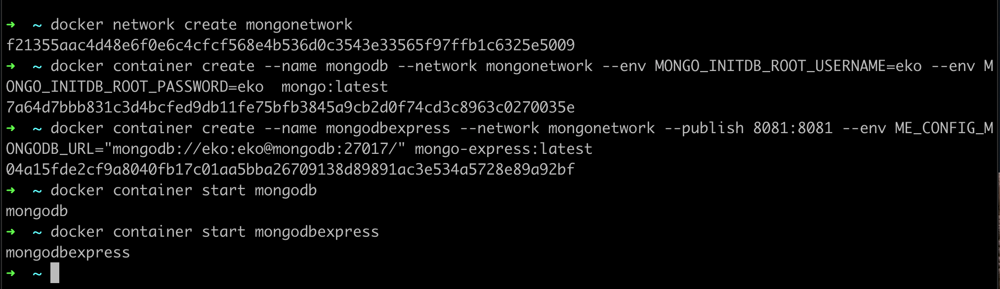

# Container Network

- Setelah kita membuat Network, kita bisa menambahkan container ke network
- Container yang terdapat di dalam network yang sama bisa saling berkomunikasi (tergantung jenis driver network nya) 
- Container bisa mengakses container lain dengan menyebutkan hostname dari container nya, yaitu nama container nya 

### Membuat Container dengan Network

Untuk menambahkan container ke network, kita bisa menambahkan perintah --network ketika membuat container, misal : ```docker container create --name namacontainer --network namanetwork image:tag```



### Menghapus Container dari Network

- Jika diperlukan, kita juga bisa menghapus container dari network dengan perintah : ```docker network disconnect namanetwork namacontainer```


### Menambahkan Container ke Network

- Jika containernya sudah terlanjur dibuat, kita juga bisa menambahkan container yang sudah dibuat ke network dengan perintah : ```docker network connect namanetwork namacontainer```


