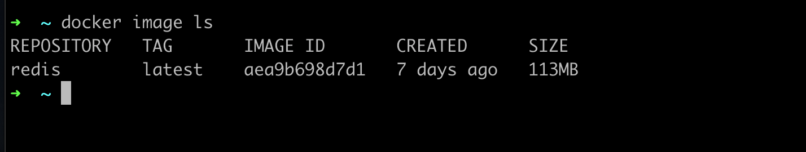
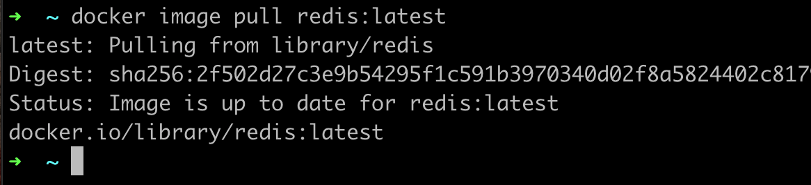
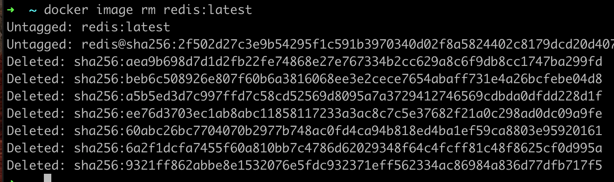

# Docker Image

- Docker Image mirip seperti installer aplikasi, dimana di dalam Docker Image terdapat aplikasi dan dependency
- Sebelum kita bisa menjalankan aplikasi di Docker, kita perlu memastikan memiliki Docker Image aplikasi tersebut 

### Melihat Docker Image

- Untuk melihat Docker Image yang terdapat di dalam Docker Daemon, kita bisa menggunakan perintah : ```docker image ls``` atau ```docker image ps```



### Download Docker Image

- Untuk download Docker Image dari Docker Registry, kita bisa gunakan perintah : ```docker image pull namaimage:tag```
- Kita bisa mencari Docker Image yang ingin kita download di https://hub.docker.com/  



### Menghapus Docker Image

- Jika kita tidak ingin menggunakan Docker Image yang sudah kita download, kita bisa gunakan perintah :
  ```docker image rm namaimage:tag```


