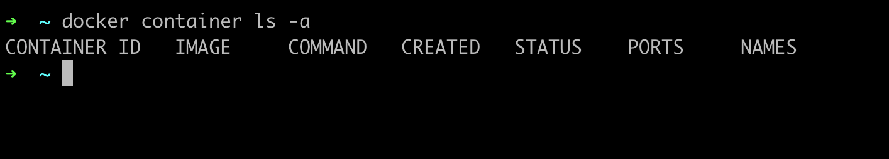
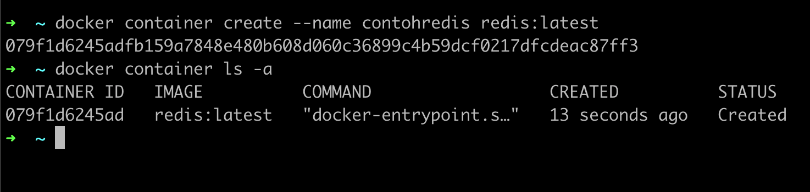
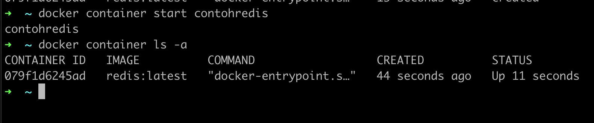
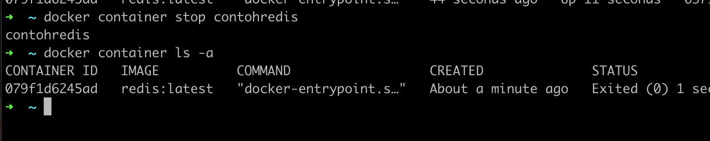
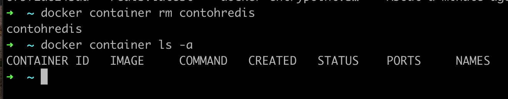

# Docker Container

- Jika Docker Image seperti installer aplikasi, maka Docker Container mirip seperti aplikasi hasil installernya
- Satu Docker Image bisa digunakan untuk membuat beberapa Docker Container, asalkan nama Docker Container nya berbeda 
- Jika kita sudah membuat Docker Container, maka Docker Image yang digunakan tidak bisa dihapus, hal ini dikarenakan sebenarnya Docker Container tidak meng-copy isi Docker Image, tapi hanya menggunakannya isinya saja 

### Status Container

- Saat kita membuat container, secara default container tersebut tidak akan berjalan
- Mirip seperti ketika kita menginstall aplikasi, jika tidak kita jalankan, maka aplikasi tersebut tidak akan berjalan, begitu juga container 
- Oleh karena itu, setelah membuat container, kita perlu menjalankannya jika memang ingin menjalankan container nya 

### Melihat Container

- Untuk melihat semua container, baik yang sedang berjalan atau tidak di Docker Daemon, kita bisa gunakan perintah : ```docker container ls -a```
- Sedangkan jika kita ingin melihat container yang sedang berjalan saja, kita bisa gunakan perintah : ```docker container ls```



### Membuat Container

- Untuk membuat container, kita bisa gunakan perintah : ```docker container create --name namacontainer namaimage:tag```



### Menjalankan Container

- Untuk menjalankan container yang sudah kita buat, kita bisa gunakan perintah : ```docker container start containerId/namacontainer```



### Menghentikan Container

- Untuk menghentikan container, kita bisa gunakan perintah : ```docker container stop containerId/namacontainer```



# Menghapus Container

- Untuk menghapus container yang sudah berhenti, kita bisa gunakan perintah : ```docker container rm containerId/namacontainer```


