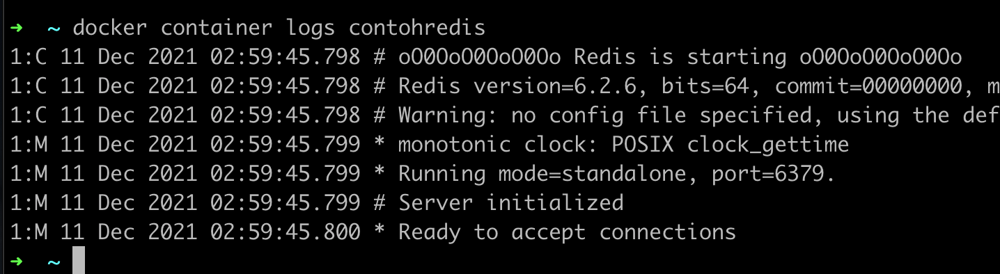

# Container Log

- Kadang saat terjadi masalah dengan aplikasi yang terdapat di container, sering kali kita ingin melihat detail dari log aplikasinya
- Hal ini dilakukan untuk melihat detail kejadian apa yang terjadi di aplikasi, sehingga akan memudahkan kita ketika mendapat masalah 

### Melihat Container Log

- Untuk melihat log aplikasi di container kita, kita bisa menggunakan perintah : ```docker container logs containerId/namacontainer```
- Atau jika ingin melihat log secara realtime, kita bisa gunakan perintah : ```docker container logs -f containerId/namacontainer```


