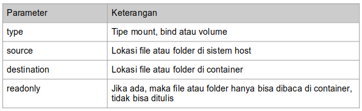
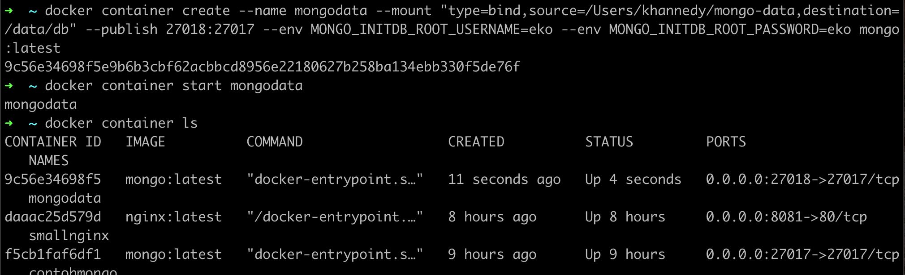

# Bind Mounts

- Bind Mounts merupakan kemampuan melakukan mounting (sharing) file atau folder yang terdapat di sistem host ke container yang terdapat di docker
- Fitur ini sangat berguna ketika misal kita ingin mengirim konfigurasi dari luar container, atau misal menyimpan data yang dibuat di aplikasi di dalam container ke dalam folder di sistem host 
- Jika file atau folder tidak ada di sistem host, secara otomatis akan dibuatkan oleh Docker 
- Untuk melakukan mounting, kita bisa menggunakan parameter --mount ketika membuat container 
- Isi dari parameter --mount memiliki aturan tersendiri 

## Parameter Mount



### Melakukan Mounting

- Untuk melakukan mounting, kita bisa menggunakan perintah berikut : ```docker container create --name namacontainer --mount “type=bind,source=folder,destination=folder,readonly” image:tag```


