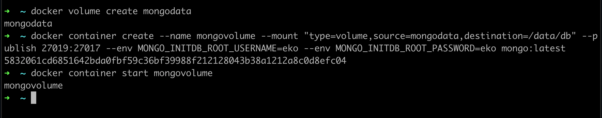

# Container Volume

- Volume yang sudah kita buat, bisa kita gunakan di container
- Keuntungan menggunakan volume adalah, jika container kita hapus, data akan tetap aman di volume 
- Cara menggunakan volume di container sama dengan menggunakan bind mount, kita bisa menggunakan parameter --mount, namun dengan menggunakan type volume dan source nama volume 

