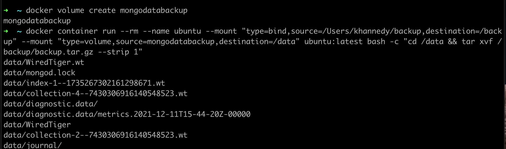

# Restore Volume

- Setelah melakukan backup volume ke dalam file archive, kita bisa menyimpan file archive backup tersebut ke tempat yang lebih aman, misal ke cloud storage
- Sekarang kita akan coba melakukan restore data backup ke volume baru, untuk memastikan data backup yang kita lakukan tidak corrupt 

### Tahapan Melakukan Restore

- Buat volume baru untuk lokasi restore data backup
- Buat container baru dengan dua mount, volume baru untuk restore backup, dan bind mount folder dari sistem host yang berisi file backup 
- Lakukan restore menggunakan container dengan cara meng-extract isi backup file ke dalam volume 
- Isi file backup sekarang sudah di restore ke volume 
- Delete container yang kita gunakan untuk melakukan restore 
- Volume baru yang berisi data backup siap digunakan oleh container baru 

