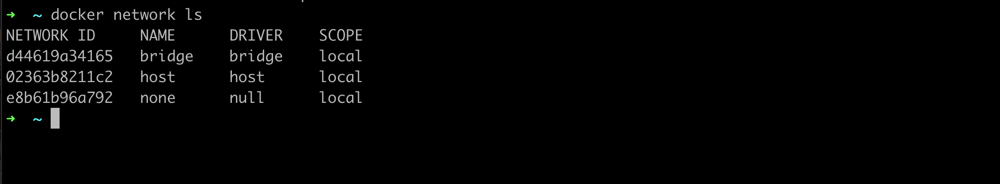
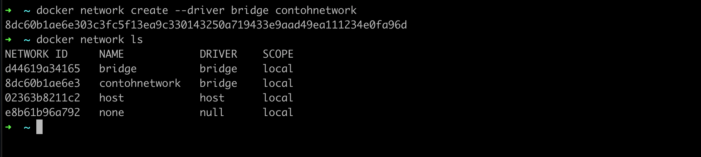
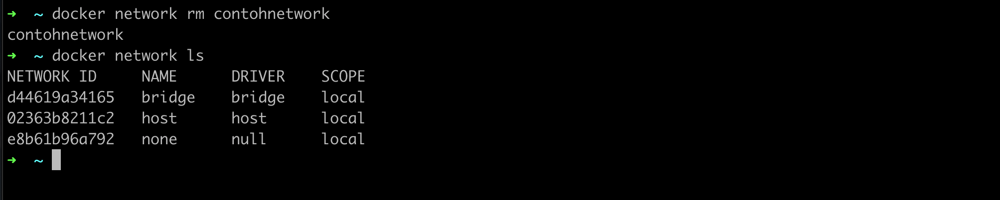

# Docker Network

- Saat kita membuat container di docker, secara default container akan saling terisolasi satu sama lain, jadi jika kita mencoba memanggil antar container, bisa dipastikan bahwa kita tidak akan bisa melakukannya
- Docker memiliki fitur Network yang bisa digunakan untuk membuat jaringan di dalam Docker 
- Dengan menggunakan Network, kita bisa mengkoneksikan container dengan container lain dalam satu Network yang sama 
- Jika beberapa container terdapat pada satu Network yang sama, maka secara otomatis container tersebut bisa saling berkomunikasi 

### Network Driver

- Saat kita membuat Network di Docker, kita perlu menentukan driver yang ingin kita gunakan, ada banyak driver yang bisa kita gunakan, tapi kadang ada syarat sebuah driver network bisa kita gunakan.
- bridge, yaitu driver yang digunakan untuk membuat network secara virtual yang memungkinkan container yang terkoneksi di bridge network yang sama saling berkomunikasi 
- host, yaitu driver yang digunakan untuk membuat network yang sama dengan sistem host. host hanya jalan di Docker Linux, tidak bisa digunakan di Mac atau Windows 
- none, yaitu driver untuk membuat network yang tidak bisa berkomunikasi  

### Melihat Network

- Untuk melihat network di Docker, kita bisa gunakan perintah : ```docker network ls```



### Membuat Network

- Untuk membuat network baru, kita bisa menggunakan perintah : ```docker network create --driver namadriver namanetwork```



### Menghapus Network

- Untuk menghapus Network, kita bisa gunakan perintah : ```docker network rm namanetwork```
- Network tidak bisa dihapus jika sudah digunakan oleh container. Kita harus menghapus container nya terlebih dahulu dari Network


