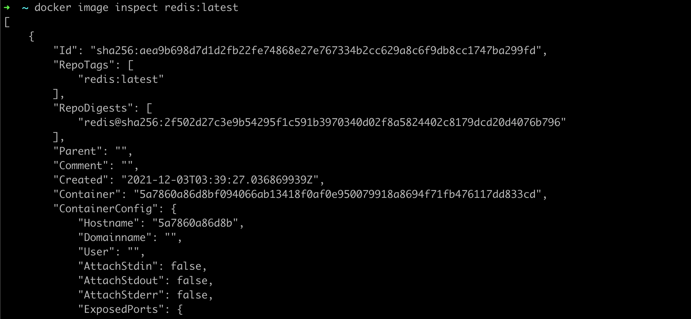

# Inspect

- Setelah kita men-download image, atau membuat network, volume dan container. Kadang kita ingin melihat detail dari tiap hal tersebut
- Misal kita ingin melihat detail dari image, perintah apa yang digunakan oleh image tersebut? Environment variable apa yang digunakan? Atau port apa yang digunakan? 
- Misal kita juga ingin melihat detail dari container, Volume apa yang digunakan? Environment variable apa yang digunakan? Port forwarding apa yang digunakan? dan lain-lain 
- Docker memiliki fitur bernama inspect, yang bisa digunakan di image, container, volume dan network 
- Dengan fitur ini, kita bisa melihat detail dari tiap hal yang ada di Docker 

### Menggunakan Inspect

- Untuk melihat detail dari image, gunakan : docker image inspect namaimage
- Untuk melihat detail dari container, gunakan : docker container inspect namacontainer 
- Untuk melihat detail dari volume, gunakan : docker volume inspect namavolume 
- Untuk melihat detail dari network, gunakan : docker network inspect namanetwork 

