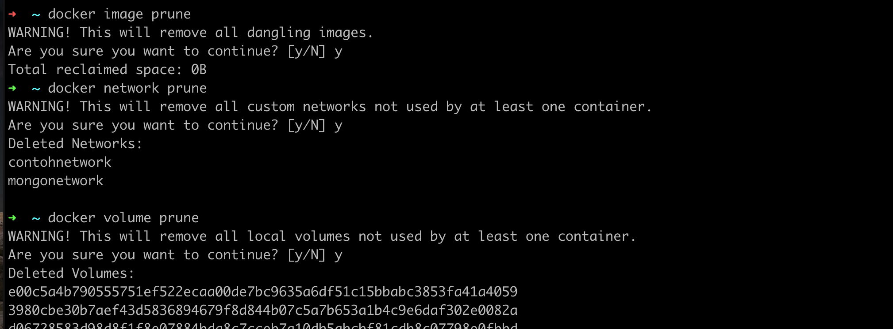

# Prune

- Saat kita menggunakan Docker, kadang ada kalanya kita ingin membersihkan hal-hal yang sudah tidak digunakan lagi di Docker, misal container yang sudah di stop, image yang tidak digunakan oleh container, atau volume yang tidak digunakan oleh container
- Fitur untuk membersihkan secara otomatis di Docker bernama prune 
- Hampir di semua perintah di Docker mendukung prune 

### Perintah Prune

- Untuk menghapus semua container yang sudah stop, gunakan : docker container prune
- Untuk menghapus semua image yang tidak digunakan container, gunakan : docker image prune 
- Untuk menghapus semua network yang tidak digunakan container, gunakan : docker network prune 
- Untuk menghapus semua volume yang tidak digunakan container, gunakan : docker volume prune 
- Atau kita bisa menggunakan satu perintah untuk menghapus container, network dan image yang sudah tidak digunakan menggunakan perintah : ```docker system prune``` 


