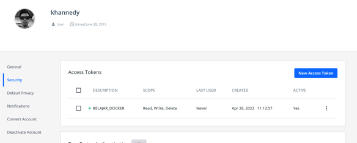

# Docker Hub Registry

- Setelah kita selesai membuat Image, selanjutnya hal yang biasa dilakukan adalah mengupload Image tersebut ke Docker Registry
- Salah satu Docker Registry yang gratis contohnya adalah Docker Hub 
- https://hub.docker.com/  

# Docker Hub Access Token

