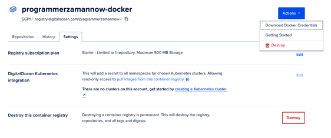
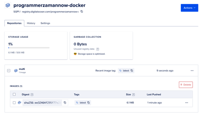

# Digital Ocean Container Registry

- Digital Ocean adalah salah satu cloud provider yang populer, dan memiliki fitur Docker Registry bernama Container Registry
- Terdapat Free Version untuk ukuran sampai 500MB yang bisa kita gunakan 
- https://www.digitalocean.com/products/container-registry  
- Silahkan buat Container Registry terlebih dahulu 

# Docker Config

- Berbeda dengan Docker Hub yang kita diperlukan melakukan login ketika ingin melakukan push ke Registry
- Di Digital Ocean, kita akan menggunakan Docker Config untuk mengirim Image ke Digital Ocean Container Registry 
- Ini lebih mudah karena kita bisa dengan gampang push Image dari manapun selama menggunakan config file yang sama 

# Download Docker Credential

# Konfigurasi Docker Config

- Secara default, Docker akan membaca config yang terdapat di $HOME/.docker
- Di dalamnya terdapat file config.json yang berisi konfigurasi credential yang sudah kita gunakan ketika login ke Docker Hub 
- Agar tidak mengganggu, khusus untuk Digital Ocean, kita akan buat folder terpisah, misal .docker-digital-ocean 
- Selanjunya file creadential yang sudah di download, silahkan ganti namanya menjadi config.json dan simpan di folder .docker-digital-ocean tersebut 

# Docker Push

- Jika kita menggunakan perintah docker push, secara default itu akan melakukan push ke Container Registry yang teregistrasi di $HOME/.docker
- Karena kita menggunakan lokasi yang berbeda untuk Digital Ocean, jadi ketika melakukan push, kita perlu mengubah default config nya menggunaka perintah :
- `docker tag rifanid/image_name registry.digitalocean.com/digitalocean_username/image_name`
- `docker --config /Path/to/docker/config/.docker-digital-ocean push registry.digitalocean.com/digitalocean_username/image_name`

# Digital Ocean Container Registry

